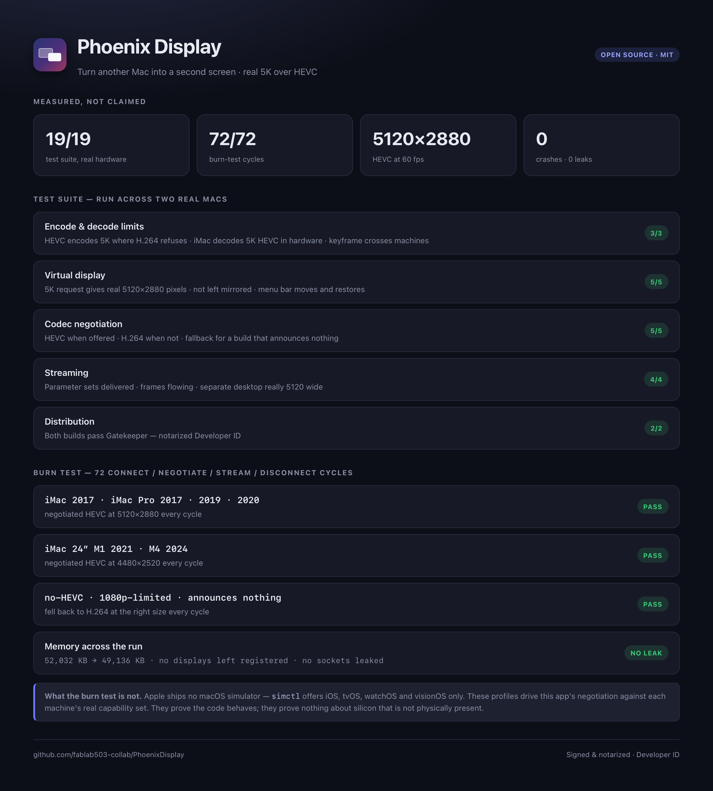
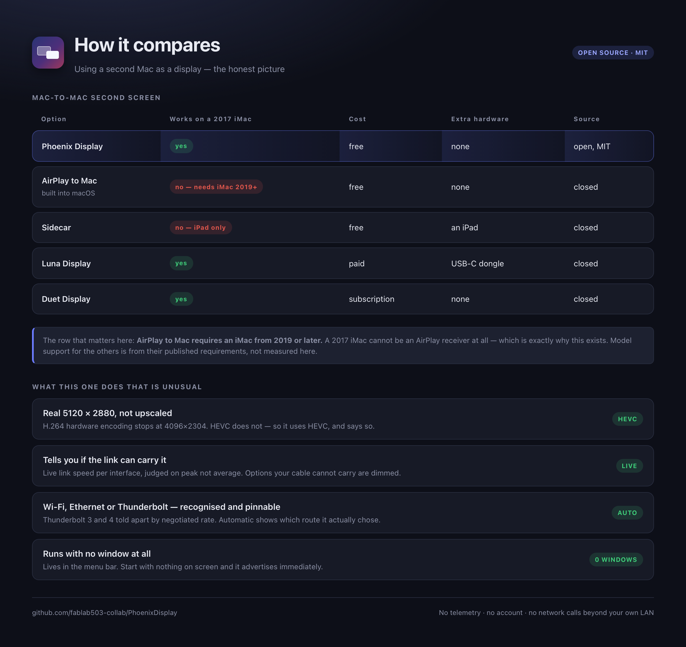
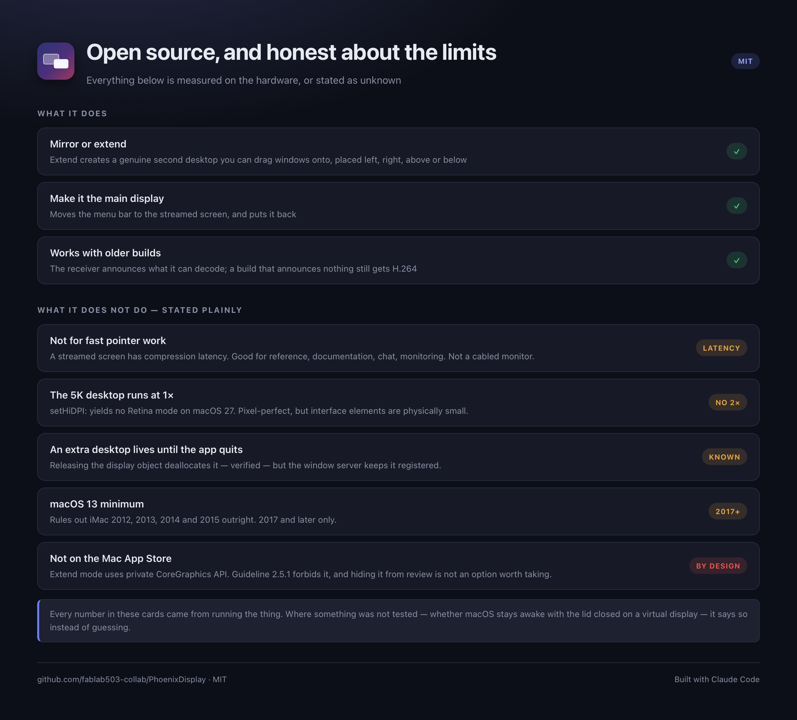

# Phoenix Display

Turn another Mac into a second screen — over Wi-Fi, ethernet or a Thunderbolt cable.
Mirror it, or extend onto it as a genuinely separate desktop.

Streams a real **5120 × 2880** desktop with HEVC. Universal binary, macOS 13 and later.







> The cards are generated from `docs/cards.html` with `Tools/shot.swift`, so they can be
> regenerated whenever the numbers change rather than drifting out of date.

---

## Why HEVC, and why that matters

Apple's hardware **H.264** encoder refuses anything above **4096 × 2304** — measured, not guessed:

```
VTCompressionSessionCreate, Apple M2 Pro
  H.264  4096x2304  ok        H.264  4480x2520  FAILS (-12903)
  HEVC   5120x2880  ok        HEVC   7680x4320  ok
```

So a full 5K desktop is impossible over H.264 and straightforward over HEVC. The receiving
Mac is asked what it can decode and the sender picks accordingly:

```
receiver connects ──► sends `caps` {codecs, maxWidth, maxHeight}
sender  ──► picks HEVC if both ends support it, else H.264
        ──► `hello` {width, height, fps, mode, codec}
        ──► `format` (VPS+SPS+PPS for HEVC, SPS+PPS for H.264)
        ──► `frame` …
```

A receiver that sends no capabilities within 1.2 s is treated as an older build and gets H.264,
so new and old versions interoperate.

Worth knowing: a 2017 Intel iMac (Kaby Lake + Radeon Pro 580) **does** decode 5120 × 2880 HEVC
in hardware. Spec sheets suggest 4K; the hardware says otherwise. The app probes rather than
assumes, via `VTIsHardwareDecodeSupported` and a real session.

## What it does

- **Mirror** — the other screen shows the same picture.
- **Extend** — a real second desktop you can drag windows onto, created with `CGVirtualDisplay`.
- **Arrangement** — put the extra screen left, right, above or below.
- **Main display** — move the menu bar to the streamed screen, so the other Mac becomes primary.
- **Network choice** — Automatic, or pin the stream to a named interface (Wi-Fi, ethernet,
  Thunderbolt Bridge). Plus connect-by-address when Bonjour is blocked.
- Discovery over Bonjour `_phoenixdisplay._tcp`, framed TCP on port 51777.

## Getting a real 5K desktop out of CGVirtualDisplay

Three things each silently cost the resolution, and each one looked like a different bug:

1. **`setSizeInMillimeters:` decides the scale.** At 109 ppi a 5120 px panel claims to be 47
   inches wide, so macOS drops to 1x and picks a low mode. A real 27-inch 5K is 218 ppi.
2. **`applySettings:` only publishes the mode list.** The display still comes up on whatever
   macOS picks by default — 1920x1080 in practice. The mode has to be selected explicitly with
   `CGConfigureDisplayWithDisplayMode`.
3. **`CGDisplayPixelsWide` returns points, not pixels.** Capturing by it quietly halves the
   picture on any HiDPI display. Use `CGDisplayModeGetPixelWidth`.

Result: a genuine 5120 x 2880 desktop, streamed at 5120 x 2880.

**One thing that does not work:** `setHiDPI:` produces no Retina mode on macOS 27 — every mode
comes back with its point size equal to its backing store. So the 5K desktop runs at **1x**:
pixel-perfect on the 5K panel, but interface elements are physically small. If you would rather
have comfortable sizing than maximum sharpness, pick 1440p and let the receiving Mac scale it.

## Honest limits

- **Latency.** Capture, encode, send, decode and display all cost time. It is good for reference
  windows, documentation, chat, monitoring. It is *not* a substitute for a cabled monitor if you
  are doing fast pointer work or anything latency-sensitive.
- **An extra desktop stays until the app quits.** Releasing the `CGVirtualDisplay` object
  deallocates it — verified with a weak reference — but the window server keeps the display
  registered. So the app creates at most one per size and reuses it.
- **Screen Recording permission is per-signature.** Ad-hoc builds get a fresh identity on every
  rebuild, so the grant resets each time. `build.sh` signs with a Developer ID when one is
  available, which keeps it.
- **macOS never prompts for Screen Recording.** `kTCCServiceScreenCapture does not allow
  prompting; returning denied` — you must add the app by hand in
  System Settings ▸ Privacy & Security ▸ Screen Recording. If it was denied before, clear the old
  decision first: `tccutil reset ScreenCapture danielscreatesparis.Phoenix-Display`.
- **Not shippable on the Mac App Store** with extend mode. See below.

## Live connection status

The Connection panel reads every interface live and shows what it actually is and how fast it
actually runs — the rate comes from `ifi_baudrate` on each interface, not from a guess:

```
Automatic          Using Ethernet (en7) - 2 Gb/s
Ethernet (en7)     IN USE   192.168.1.19 - 2 Gb/s
Wi-Fi (en0)                 192.168.1.43 - 239 Mb/s
Thunderbolt: 246x at 40 Gb/s
```

Thunderbolt is recognised separately: the app asks the system whether a device is attached and
at what rate, which is what distinguishes Thunderbolt 3 (20 Gb/s) from 4 (40 Gb/s). A Thunderbolt
cable only carries the stream once Thunderbolt Bridge exists as a network service on both Macs,
and the app says so rather than pretending the cable is in use.

Automatic follows whatever route macOS prefers, and the badge shows which one that is. Pick a
specific interface to pin the stream to it.

## Will the link carry it

Each quality option is checked against the live link speed, using the peak rather than the
average — the encoder is allowed 1.8x for keyframes, and a link that cannot absorb the peak
stutters even when the average fits.

```
Sharp     30 fps - 80 Mbps  - plenty of headroom
Balanced  45 fps - 100 Mbps - plenty of headroom
Smooth    60 fps - 120 Mbps - plenty of headroom

5120 x 2880 at 60 fps needs about 120 Mbps, peaking near 216 Mbps.
Ethernet (en7) gives 2 Gb/s - plenty of headroom.
```

Anything the link cannot carry is dimmed and labelled, instead of being offered and then
stuttering.

## Running with no window

The app lives in the menu bar. Closing the window does not quit it — the stream keeps running.

- **Hide window (keep streaming)** — ⇧⌘H, or the Hide button on the sending screen.
- **Start with no window** — tick it in the menu bar item and the app launches straight into
  the menu bar and starts advertising, with nothing on screen at all.
- The menu bar icon shows the state, and carries Start/Stop, Show window and Quit.

## Which iMacs can run this

The app needs macOS 13. That rules out more than half the iMacs since 2012:

| iMac | newest macOS | runs Phoenix Display |
|---|---|---|
| 2012 21.5 / 27 | Catalina 10.15 | no |
| 2013 21.5 / 27 | Catalina 10.15 | no |
| 2014 Retina 5K | Big Sur 11 | no |
| 2015 21.5 / 27 | Monterey 12 | no |
| 2017 21.5 / 27 5K | Ventura 13 | yes |
| iMac Pro 2017 | Ventura 13 | yes |
| 2019 27 | Sequoia 15 | yes |
| 2020 27 | Sequoia 15 | yes |
| 24-inch M1 2021 and later | current | yes |

ScreenCaptureKit itself needs macOS 12.3, so the floor could be lowered a little, but not to
2015 and certainly not to 2012 — those would need the deprecated CGDisplayStream path.

## Testing

`Tools/compat.swift` probes any Mac and reports exactly what it can do as a sender and a
receiver — encode and decode limits per codec and size, whether extend mode is available, and a
verdict. Every answer is measured, none is assumed.

```sh
swiftc -O -o phoenix-compat Tools/compat.swift && ./phoenix-compat
```

`Tools/testsuite.sh` runs 19 cases for real against a second Mac over ssh: codec limits at both
ends, a 5K keyframe encoded on one machine and decoded on the other, virtual-display sizing and
arrangement, all three codec-negotiation paths including an old receiver that announces nothing,
live streaming in both modes, and Gatekeeper on both builds.

```sh
PHOENIX_IMAC=user@host PHOENIX_KEY=~/.ssh/id_ed25519 ./Tools/testsuite.sh
```

`Tools/burntest.sh` hammers the sender with repeated connect / negotiate / stream / disconnect
cycles while impersonating the capability profile of every iMac that can run the app, plus a
receiver with no HEVC, one limited to 1080p, and an old build that announces nothing at all.

```sh
ROUNDS=8 SECS=4 ./Tools/burntest.sh
```

**What this is not:** Apple ships no macOS simulator — `simctl list runtimes` offers iOS, tvOS,
watchOS and visionOS only. There is no way to simulate a 2012 iMac's video hardware. The burn
test drives *this app's* negotiation and streaming against each machine's real capability
profile, many times over. It proves the code behaves; it proves nothing about silicon that is
not physically present.

Last run: 72 cycles, 72 passed, 0 failed. Resident memory went 52,032 KB -> 49,136 KB across the
run, no virtual displays left registered, no crash reports.

## Build

```sh
./build.sh
```

Universal (arm64 + x86_64), minimum macOS 13.0. Signs with the first Developer ID certificate it
finds; override with `CODESIGN_IDENTITY`. No Xcode project — plain `swiftc` + `clang`.

Notarize for distribution:

```sh
APP="build/Phoenix Display.app"
ditto -c -k --keepParent "$APP" /tmp/notarize.zip
xcrun notarytool submit /tmp/notarize.zip --keychain-profile notarytool --wait
xcrun stapler staple "$APP"
spctl --assess --type execute -vv "$APP"   # want: accepted, Notarized Developer ID
```

Sign first, then notarize, then staple. Signing after notarizing throws the ticket away.

## Mac App Store

**Extend mode cannot ship on the App Store.** It depends on the private CoreGraphics classes
`CGVirtualDisplay`, `CGVirtualDisplayDescriptor`, `CGVirtualDisplayMode` and
`CGVirtualDisplaySettings`. Resolving them at runtime with `NSClassFromString` avoids link-time
imports, but it does not make the app compliant — App Store Review Guideline 2.5.1 prohibits
private API use however it is reached. Hiding it from review is not an option worth taking.

The notarized Developer ID build has no such restriction, which is how this is distributed.

## Layout

| path | job |
|---|---|
| `Shim/PhoenixVD.{h,m}` | crash-proof `CGVirtualDisplay` wrapper, un-mirror, arrangement, main display |
| `Sources/Capture.swift` | ScreenCaptureKit capture, H.264 + HEVC hardware encoder |
| `Sources/Capabilities.swift` | probes what this Mac can actually encode and decode |
| `Sources/Net.swift` | Bonjour, framed TCP, capability handshake, backpressure |
| `Sources/Transport.swift` | interface enumeration and pinning |
| `Sources/DisplayView.swift` | receiver rendering via `AVSampleBufferDisplayLayer` |
| `Sources/SenderEngine.swift` | ties capture, encode, network and the virtual display together |
| `Tools/` | standalone probes used to establish the facts above |

## Tools

- `Tools/caps.swift` — which codecs and sizes this Mac will hardware-encode.
- `Tools/hevcprobe.swift` — encodes a real 5K HEVC keyframe on one Mac, decodes it on another.
- `Tools/vdtest.m` — creates a virtual display and prints the mirror state before/during/after.
- `Tools/probe.swift` — connects to a running sender and reports codec, frame rate and bitrate.

## Licence

MIT. See [LICENSE](LICENSE).
